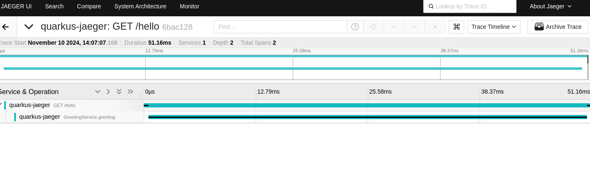

# Quarkus Jaeger Tracing Example

This project demonstrates how to set up distributed tracing in a Quarkus application using **Jaeger** and **OpenTelemetry Collector**. It uses Docker to run both Jaeger and the OpenTelemetry Collector, which receives trace data from Quarkus and forwards it to Jaeger for visualization.

## Prerequisites

- **Docker**: Make sure Docker is installed and running on your system.
- **JDK 21**

## Project Structure

- **docker-compose.yml**: Configures and runs Jaeger and the OpenTelemetry Collector using Docker.
- **otel-collector-config.yml**: Configuration file for the OpenTelemetry Collector to receive and forward traces.
- **src/main/resources/application.properties**: Quarkus application configuration for OpenTelemetry.

## Getting Started

### 1. Clone the Repository

```bash
git clone <repository-url>
cd <repository-directory>
```

### 2. Build the Quarkus Application

Before running the application, you can build it to ensure all dependencies are set up correctly:

```bash
mvn clean package
```

### 3. Start Jaeger and OpenTelemetry Collector

Use Docker Compose to start the Jaeger and OpenTelemetry Collector services:

```bash
docker-compose up -d
```

This will:
- Start Jaeger on port `16686` for the UI and `4317` for receiving OTLP traces.
- Start the OpenTelemetry Collector, configured to receive OTLP data on port `4317` and forward it to Jaeger.

### 4. Run the Quarkus Application

Start the Quarkus application in development mode:

```bash
.mvn quarkus:dev
```

The application is now running and ready to send trace data to the OpenTelemetry Collector.

### 5. Access Jaeger UI

Open your web browser and go to:

```
http://localhost:16686
```

This URL opens the Jaeger UI where you can search for traces from your Quarkus application.

### Application Configuration

Key configuration settings for OpenTelemetry in `application.properties`:

```properties
# Enable OpenTelemetry tracing
quarkus.opentelemetry.enabled=true

# Set the OTLP endpoint to the OpenTelemetry Collector on port 4317
quarkus.opentelemetry.tracer.exporter.otlp.endpoint=http://localhost:4317
quarkus.opentelemetry.tracer.exporter.otlp.protocol=grpc

# Application name in Jaeger
quarkus.application.name=my-quarkus-app
```

### Stopping the Services

To stop the application and services, use:

1. Stop the Quarkus application:
   ```bash
   CTRL+C  # If running in terminal
   ```

2. Shut down Docker services:
   ```bash
   docker-compose down
   ```

## Additional Notes

- **OpenTelemetry Collector**: Acts as a bridge, receiving trace data from the Quarkus application and forwarding it to Jaeger using OTLP.
- **Jaeger UI**: Displays the traces for easy inspection and debugging of the application's distributed tracing.
- **Trace Data in CDI**: Add Span for specific service, see GreetingService.java




## Troubleshooting

If you experience issues:
- Check that Docker services are running: `docker ps`
- Confirm the Quarkus application is running without errors.
- Ensure `application.properties` configurations match those in `otel-collector-config.yml`.

## License

This project is licensed under the MIT License.
